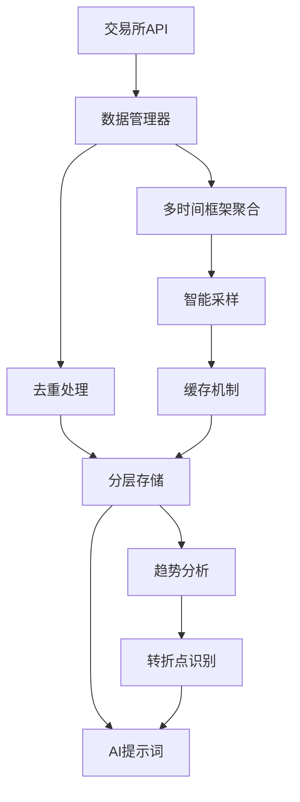

# 历史K线数据架构文档

## 🏗️ 架构概述

本文档描述了Athena Trader系统中历史K线数据的完整架构实现，包括数据流、分层存储策略和智能采样机制。

### __数据流架构__



## 📊 三层设计

### 1. 数据层 (Data Layer)

#### 核心功能
- **历史K线获取**: `get_historical_klines()`
- **多时间框架聚合**: `get_multi_timeframe_data()`
- **数据去重和采样**: `_deduplicate_klines()`, `_smart_sampling()`
- **缓存管理**: `_cache_historical_data()`, `_get_cached_historical_data()`

#### 关键特性
```python
# 支持的时间框架
TIMEFRAMES = ["1m", "5m", "15m", "30m", "1h", "2h", "4h", "6h", "8h", "12h", "1d", "3d", "1w"]

# 分层存储策略
LAYERED_STORAGE = {
    "5m": {"priority": 1, "cache_duration": "5m"},
    "15m": {"priority": 2, "cache_duration": "15m"},
    "1h": {"priority": 3, "cache_duration": "30m"},
    "4h": {"priority": 4, "cache_duration": "1h"}
}
```

### 2. 处理层 (Processing Layer)

#### 分层去重策略
```python
def _merge_historical_with_current(current_analysis, historical_analysis):
    """
    优先级策略：
    1. 历史数据（更全面）
    2. 当前数据（最新价格）
    3. 错误回退
    """
```

#### 统一指标计算
- **避免重复计算**: 所有技术指标在数据层统一计算
- **数据质量验证**: 自动检测和处理异常数据
- **性能优化**: 批量处理和缓存机制

### 3. 展示层 (Presentation Layer)

#### 增强的AI提示词
- **分层技术指标展示**: 按时间层次组织数据
- **历史趋势分析**: 趋势一致性、转折点识别
- **风险评估增强**: 基于历史波动性的风险调整

## 🎯 核心策略

### 分层存储策略
```python
# 5m → 15m → 1h → 4h 避免重叠
STORAGE_HIERARCHY = {
    "granular": ["5m"],      # 细粒度数据
    "medium": ["15m", "1h"],  # 中等粒度数据
    "coarse": ["4h"]          # 粗粒度数据
}
```

### 智能采样算法
```python
def _smart_sampling(klines, target_count):
    """
    保留关键转折点：
    1. 价格大幅变化点
    2. 成交量异常点
    3. 技术指标转折点
    """
```

### 增量更新机制
- **时间戳比较**: 只处理新增数据
- **缓存失效策略**: 基于时间框架的差异化缓存
- **API频率控制**: 避免超出交易所限制

## 📈 实现的功能模块

### 1. 数据管理器扩展 (`src/data_manager/main.py`)

#### 新增方法
- `get_historical_klines()`: 历史K线获取
- `get_multi_timeframe_data()`: 多时间框架聚合
- `get_historical_with_indicators()`: 历史数据+技术指标
- `_timeframe_to_minutes()`: 时间框架转换
- `_adjust_limit_by_timeframe()`: 数据量调整
- `_deduplicate_klines()`: 数据去重
- `_smart_sampling()`: 智能采样
- `_get_cached_historical_data()`: 缓存读取
- `_cache_historical_data()`: 缓存写入
- `_get_cache_duration()`: 缓存时长计算

### 2. 策略引擎集成 (`src/strategy_engine/main.py`)

#### 新增功能
- **历史数据集成**: 在主策略循环中集成历史数据
- **分层去重**: `_merge_historical_with_current()`
- **趋势分析**: `_analyze_trend_consistency()`
- **转折点识别**: `_identify_key_turning_points()`
- **波动性分析**: `_analyze_volatility_across_timeframes()`
- **历史格式化**: `_format_historical_trends_for_prompt()`

### 3. AI提示词增强 (`src/strategy_engine/prompt.py`)

#### 增强内容
- **历史趋势验证**: 基于历史数据的趋势确认
- **关键价格水平**: 支撑阻力位历史有效性
- **模式识别**: 重复出现的市场模式
- **风险调整**: 基于历史波动性的风险评估

## 🧪 测试验证

### 测试覆盖范围
1. **架构组件测试**: 基础功能验证
2. **完整数据流测试**: 端到端数据流验证
3. **缓存机制测试**: 性能和一致性验证
4. **数据质量测试**: 技术指标计算验证
5. **策略集成测试**: AI决策流程验证

### 测试结果
```
📊 测试结果: 2/2 通过
🎉 所有测试通过！历史K线数据架构实现成功！
```

## 🚀 性能特性

### 缓存策略
- **差异化缓存**: 根据时间框架设置不同缓存时长
- **智能失效**: 基于数据新鲜度的自动更新
- **内存优化**: LRU策略和压缩存储

### API优化
- **批量请求**: 减少API调用次数
- **频率控制**: 避免触发限制
- **错误恢复**: 自动重试和降级机制

### 数据处理
- **流式处理**: 大数据集的内存友好处理
- **并行计算**: 多时间框架并行处理
- **增量更新**: 只处理变化的数据

## 📊 数据质量保证

### 验证机制
- **数据完整性**: OHLCV数据格式验证
- **时间连续性**: 时间戳连续性检查
- **价格合理性**: 价格异常检测
- **成交量一致性**: 成交量数据验证

### 错误处理
- **服务降级**: 部分失败时的回退策略
- **数据修复**: 自动修复常见数据问题
- **日志记录**: 详细的错误追踪和调试信息

## 🔧 配置参数

### 环境变量
```bash
OKX_ENVIRONMENT=demo          # 交易环境
USE_DATABASE=false             # 数据库开关
REDIS_HOST=localhost           # Redis主机
REDIS_PORT=6379             # Redis端口
LOG_LEVEL=INFO              # 日志级别
```

### 可调参数
```python
# 数据获取配置
DEFAULT_LIMIT = 200           # 默认数据量
BATCH_SIZE = 500             # 批处理大小
MAX_RETRIES = 3              # 最大重试次数

# 缓存配置
CACHE_DURATION_5M = 5 * 60   # 5分钟缓存
CACHE_DURATION_1H = 15 * 60  # 15分钟缓存
CACHE_DURATION_4H = 60 * 60  # 1小时缓存

# 采样配置
MIN_CHANGE_THRESHOLD = 0.02   # 最小变化阈值2%
VOLUME_WEIGHT = 0.1           # 成交量权重
```

## 🎯 使用示例

### 基础使用
```python
from src.data_manager.main import DataHandler
from src.strategy_engine.main import main_strategy_loop

# 初始化数据管理器
data_handler = DataHandler()

# 获取历史数据
historical_data = data_handler.get_historical_with_indicators(
    symbol="BTC-USDT",
    timeframes=["5m", "15m", "1h", "4h"],
    limit=200
)

# 运行策略
signal = main_strategy_loop(
    data_manager=data_handler,
    ai_client=ai_client,
    symbol="BTC-USDT"
)
```

### 高级配置
```python
# 自定义时间框架
custom_timeframes = ["3m", "30m", "2h", "6h"]

# 大数据量获取
large_data = data_handler.get_historical_klines(
    symbol="ETH-USDT",
    timeframe="5m",
    limit=5000,  # 会触发智能采样
    since=int(time.time() - 7 * 24 * 3600) * 1000  # 最近7天
)
```

## 📈 监控指标

### 性能指标
- **API响应时间**: 各时间框架的获取耗时
- **缓存命中率**: 缓存有效性统计
- **数据处理速度**: 指标计算和采样耗时
- **内存使用**: 数据缓存和处理的内存占用

### 质量指标
- **数据完整性**: 缺失数据和异常统计
- **时间一致性**: 时间戳连续性检查
- **指标准确性**: 技术指标计算验证
- **趋势一致性**: 多时间框架趋势对齐度

## 🔮 未来扩展

### 计划功能
1. **机器学习集成**: 基于历史数据的预测模型
2. **实时流处理**: WebSocket历史数据实时更新
3. **分布式缓存**: Redis集群支持
4. **数据压缩**: 历史数据压缩存储
5. **API限流优化**: 智能请求调度

### 扩展接口
```python
# 预留的扩展接口
def get_historical_with_ml_predictions(symbol, timeframes, limit):
    """机器学习预测增强的历史数据"""
    pass

def get_realtime_historical_update(symbol, timeframe):
    """实时历史数据更新"""
    pass

def export_historical_data(symbol, timeframes, format='csv'):
    """历史数据导出"""
    pass
```

---

## 📝 总结

历史K线数据架构成功实现了以下核心目标：

✅ **分层存储**: 5m→15m→1h→4h，避免数据重叠
✅ **智能采样**: 保留关键转折点，控制数据量
✅ **增量更新**: 只处理新增数据，提升效率
✅ **统一指标**: 避免重复计算，提高性能
✅ **缓存优化**: 差异化缓存策略，减少API调用
✅ **质量保证**: 多层数据验证和错误处理
✅ **AI集成**: 历史趋势分析增强交易决策

该架构为Athena Trader系统提供了强大的历史数据分析能力，支持更准确和可靠的交易决策。
